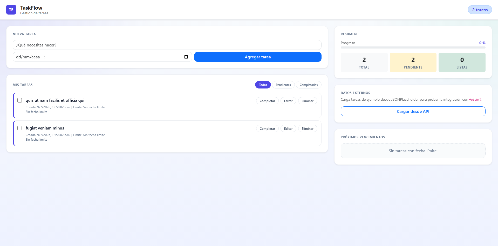

# TaskFlow: Aplicación de Gestión de Tareas en JavaScript

Evaluación del módulo — Programación Avanzada en JavaScript

[](https://github.com/scarvallot/taskflow.git)

---

## Contexto

El Departamento de Desarrollo Web ha encargado la construcción de una aplicación web interactiva
basada en JavaScript. La problemática a resolver es ofrecer una herramienta funcional que permita a
los usuarios gestionar tareas de manera eficiente. Se utilizará un enfoque basado en la orientación
a objetos, eventos del DOM y consumo de APIs para lograr una aplicación moderna y escalable.

---

## Objetivo

Desarrollar una aplicación web interactiva que permita gestionar tareas de manera eficiente utilizando
JavaScript moderno. Se implementarán principios de programación orientada a objetos, manipulación del
DOM, eventos, asincronía y consumo de APIs para crear una herramienta escalable y funcional.

La aplicación debe permitir a los usuarios:

- Crear, editar y eliminar tareas.
- Utilizar eventos para mejorar la interactividad.
- Manejar datos de manera asincrónica.
- Integrar consumo de APIs para funcionalidades adicionales (como almacenamiento o sincronización
  de tareas).

---

## Requerimientos

### Generales

- Implementar principios de orientación a objetos en JavaScript.
- Usar sintaxis moderna de ES6+.
- Manipular el DOM de forma eficiente.
- Manejar eventos de usuario.
- Implementar funciones asincrónicas para trabajar con datos externos.
- Consumir una API para almacenamiento o funcionalidades extra.

---

## Criterios de Validación

- Correcta aplicación de la orientación a objetos.
- Uso de ES6+ en la implementación del código.
- Interactividad lograda a través del manejo de eventos.
- Correcto manejo de asincronía.
- Implementación y validación del consumo de APIs.

---

## Entregables

- Código fuente documentado.
- Demostración funcional.
- Explicación del código en un informe breve.

---

## Funcionamiento de la aplicación

TaskFlow es una aplicación web para gestionar tareas de manera sencilla e intuitiva. La aplicación permite:

- Crear nuevas tareas.
- Marcar tareas como completadas.
- Editar el contenido de una tarea.
- Eliminar tareas.
- Visualizar un resumen de tareas próximas a vencer.

La interacción se basa en la manipulación del DOM y el manejo de eventos. Cada acción del usuario actualiza la interfaz de forma inmediata, manteniendo visibles los estados de cada tarea y mejorando la organización del trabajo.

## Captura de pantalla

A continuación se muestra una imagen del funcionamiento de TaskFlow:



---

## Arquitectura de la Aplicación

- Arquitectura por capas (Layered /N-Tired Architecture)

```markdown
  taskflow/
  ├── .eslintrc
  ├── .git/
  ├── .gitignore
  ├── .prettierrc
  ├── app.js
  ├── index.html
  ├── LICENSE
  ├── README.md
  └── src/
      ├── assets/
      │   └── taskflow-Screenshot.png
      ├── controllers/
      │   └── eventHandlers.js
      ├── models/
      │   ├── GestorTarea.js
      │   └── Tarea.js
      ├── services/
      │   ├── apiService.js
      │   └── storageService.js
      ├── styles/
      │   └── main.css
      └── views/
          └── ui.js
```

---

<br>
  <div align="center">
    <p>Crafted by <b><a href="https://github.com/scarvallot">whiterabbit 🕳🐇</br><strong>2026</strong></p</a></b></p>
    <a href="https://github.com/scarvallot/taskflow.git">
    </a>
  </div>
<br>
